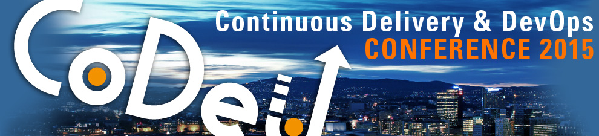
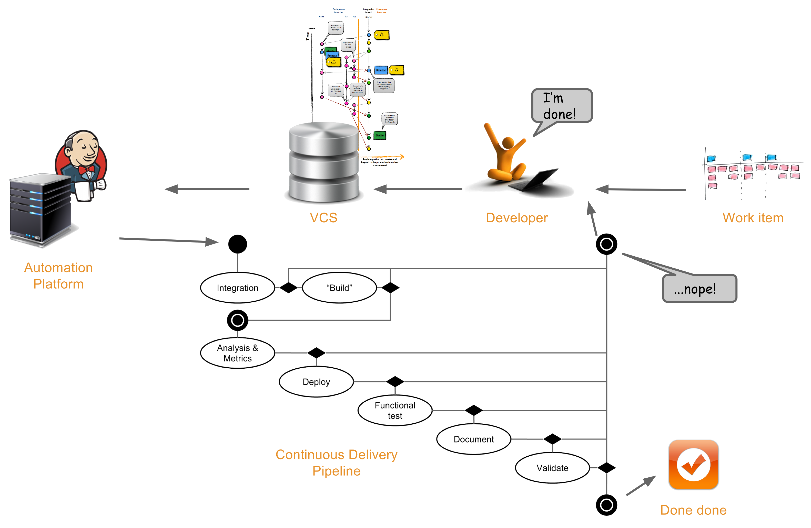

{: style="width:0px; height:0px;"}

#Continuous Delivery & DevOps Conference

##In the heart of Oslo.
__April 29th, 2015 at Hotel Bristol Oslo.__

######The Continuous Delivery & DevOps conference gathers IT executives, managers, software architects & developers for a day of inspiring speaks and intensive knowledge exchange on the latest trends on delivering quality software.

_CoDe conferences_{: .inverted} bring together technologists and industry leaders who are passionate about innovation through Continuous Delivery and DevOps. Together we'll be exploring the multi-faceted area of `CoDe` covering the entire Continuous Delivery storyline and the many changes that impact how to produce and deliver quality software today.

[{: .stdcenter #big }](http://www.praqma.com/cdmaturity){: target="_blank"}

Whether you’re well on your way to adopt CoDe practices in your organization, or just scratching the surface, `CoDe` is the place to learn the natural next step need in your Continuous Delivery journey.

`CoDeOSL` seeks to provide inspiring and actionable information for key decision makers responsible for products and services that depend on software. **_See what worked, what didn’t, what are best practices, and what value `CoDe` can bring to your business_.**

_How good is your Continuous Delivery Kung Fu?_{: .inverted } Take the [online self-assessment](http://cdmi.praqma.net){: target="_blank"} to know your CDMI = Continuous Delivery Maturity Index.
